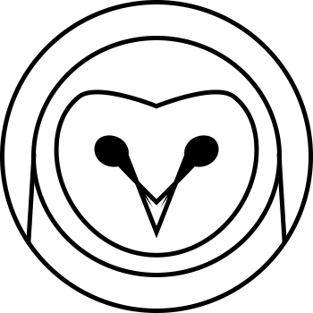
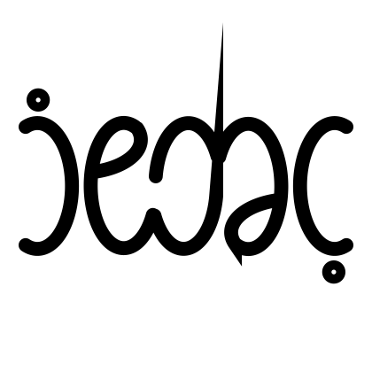
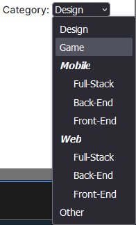

# Project brief

## Portfolio

### About ernesto muñoz

Ernesto is a 25 year old web designer and web developer full stack developer based in chihuahua
He has worked on some full stack applications
He is available for both freelance and employment work and can be contacted using this information
Ernesto mc dev proton me
52 627 150 2796

### Logo




### Structure

It should have a page for each plus the landing

-   Home page
-   Projects
    -   Project details
-   Contact
-   Admin dashboard
-   About me

#### Home page

This page should showcase your best work provide a brief description of me and show companies ive worked with and testimonials

-   Navbar
    -   should have links
    -   should have a theme selector
        -   toggle button
            -   light
            -   dark
        -   theme (optgroups)
            -   seasonal
                -   spring
                -   summer
                -   fall
                -   winter
            -   festive
                -   christmas
                -   halloween
                -   etc
            -   aesthetic
                -   vaporwave
                -   cyberpunk
                -   retro
                -   etc
-   Logo collection of companies i've worked with
    -   grid
    -   small logos (6rem tall)
-   My work
    -   Carousel
        -   Featured projects
-   Testimonials (display only 1, 2, or 3, or 5 and only golden, silver and bronze testimonials)
    -   Carousel
        -   best feedback from clients, should pull from the database based on rating and date (most recent)
        -   card
            -   border and background color based on rating (gold 5.00-4.50, silver 4.49 - 3.50, bronze 3.49 - 2.55)
            -   gold should have a decoration on the top right corner
                -   star,trophy, medal, crown, etc
            -   logo or face of client
            -   brief review (if it exists)
            -   rating displayed as n/5 stars (partial filling should be possible)
                -   note: ratings stored as 0.00-5.00

#### Projects

##### Cards Display

should be paginated and filtered

##### Filters

ordered by rating and date (most recent, and best rated)
Filter by

-   By age
    -   Date range picker
-   By structure
    -   Standalone
    -   Composite
        -   Parent
        -   Child
        -   All
    -   All
-   By tech

    -   Databases
        -   types
            -   SQL
            -   NoSQL
            -   Any(default)
        -   languages(include only if matching type)
            -   Any (default)
            -   PostgreSQL()
            -   MongoDB
    -   Languages
        -   Paradigm
            -   Procedural
            -   Object Oriented
            -   Functional
            -   Declarative
            -   Event Driven
            -
        -   Type
            -   Performance
            -   Scripting
            -   Markup
            -   Styling
            -   Safety
            -
    -   Frameworks
    -   Libraries
    -   Tools
    -   All

-   Category
    

```html
<label for="category_select">Category:</label>
<select id="cat_select">
    <option>Design</option>
    <option>Game</option>
    <optgroup label="Mobile">
        <option>Full-Stack</option>
        <option>Back-End</option>
        <option>Front-End</option>
    </optgroup>
    <optgroup label="Web">
        <option>Full-Stack</option>
        <option>Back-End</option>
        <option>Front-End</option>
    </optgroup>
    <option>Other</option>
</select>
```

Projects can use other projects as dependencies, in which case they may be displayed as dependencies in the details of the dependent project, but not as composite projects unless they are also composite projects

#### Project details

This is a page for showing data about each project it should have
TODO: I need a better understanding of mongodb to model the data

```Json
{
    "name": "Project name",
    "category": {
        "name": Enum("design", "game", "Mobile", "Web", "other"),
        "subcategory":Enum("Full-Stack", "Back-End", "Front-End")//if mobile or web,field is null or absent otherwise
    },
    "structure": {
        "name": Enum("standalone", "composite"),
        "family": {
            "parent": {
                "name": "Parent project name",
                "link": "Parent project link",
            },
            "children": [
                {
                    "name": "Child project name",
                    "link": "Child project link",
                },
            ],
            "siblings": [
                {
                    "name": "Sibling project name",
                    "link": "Sibling project link",
                },
            ],
        },
    },
    "tech": {
        "databases": [
            {
                "name": "Database name",
                "link": "Database link",
                 "logo":{
                    "link":"logo link",
                    "alt":"logo alt text"
                }
                ,
                "type":["SQL","NoSQL","Vector",etc]
            },
        ],
        "languages": [
            {
                "name": "Language name",
                "link": "Language link",
                            "logo":{
                    "link":"logo link",
                    "alt":"logo alt text"
                }
                "type": [
                    "front-end",
                    "back-end",
                    "full-stack",
                    etc.,
                ]
            },
        ],
        "frameworks": [
            {
                "name": "Framework name",
                "link": "Framework link",
                            "logo":{
                    "link":"logo link",
                    "alt":"logo alt text"
                }
                                "type": [
                    "front-end",
                    "back-end",
                    "full-stack",
                    etc.,
                ]
            },
        ],
        "libraries": [
            {
                "name": "Library name",
                "link": "Library link",
                            "logo":{
                    "link":"logo link",
                    "alt":"logo alt text"
                }            "type": [
                    "front-end",
                    "back-end",
                    "full-stack",
                    etc.,
                ]
            },
        ],
        "tools": [
            {
                "name": "Tool name",
                "link": "Tool link",
                "logo":{
                    "link":"logo link",
                    "alt":"logo alt text"
                }
                "type": [
                    "front-end",
                    "back-end",
                    "full-stack",
                    etc.,
                ]
            },
        ],
    },
    "gallery": [
        {
            "type": Enum("image", "video"),
            "thumbnail": boolean,
            "link": "image or video link",
            "alt": "image or video alt text",
        },
    ],
    "links": [
        {
            "name": "Link name",
            "link": "Link link",
        },
    ],
    "dependencies": [
        {
            "name": "Dependency name",
            "link": "Dependency link",
        },
    ],
}
```

-   Name
-   Category
-   Structure
-   Tech used
-   Gallery (carousel)
    -   one should be a thumbnil
    -   image
        -   image
    -   video
        -   embeded video
-   Link
    -   deploy
    -   repo
-   Family
    -   Parent
    -   Children
    -   Siblings
-   dependencies
    -   projects that I made and then used as dependencies, but are not family with this project
-   Client feedback
    -   Name
    -   Logo
    -   Rating
        -   stars(partial filling, 0-5)
    -   Description

#### Feedback

here the client can leave feedback about the project, it is a form

-   Rating
    -   stars(partial filling, 0-5)
    -   numeric input
-   Review
    -   Brief (optional)
    -   In depth (optional)
-   Associated projects (at least one )
    -   this will search for the project and if it exists it will be associated with it, and display a card with the project names and image and a link to the project details page
-   submit button
    -   validated and disabled appropiately

#### Contact

Big modal kinda like a hero, contact data on the left contact form on the right

Should provide your contact data to the prospective client

-   Name
-   Email
-   Phone
-   Social media
    -   Facebook
    -   Twitter
    -   Linkedin
    -   Github
-   Calendly (if possible, embeded in the page to make ux better)
    TODO: check if this is possible, if not, just link to it

And a contact form, contact should be sent to your email and stored in a database

```json
{
    "name": "name",
    "affiliation": "affiliation",
    "contact_data": {
        "phone": "phone",
        "email": "email"
    },
    "message": "message",
    "contact_date_data": {
        "date": "date",
        "time": "time"
    },
    "appointment_data": {
        "date": "date",
        "time": "time",
        "status": "status"
        "outcome": "outcome"
    }

}
```

-   Name
    -   char limit 50, displayed as charcount/50
-   Affiliation (optional)
    -   char limit 50, displayed as charcount/50
-   Contact
    -   Email( mandatory)
        -   validated with both typescript and html (for autocomplete)
        -   is used as client id for the dashboard
    -   Phone (optional)
        -   validated with both typescript and html (for autocomplete)
-   Message
    -   char limit 500, displayed as charcount/500

#### Admin dashboard

(protected route, only accessible to you)

TODO: Secure this route with a password

##### Clients

-   Create modify records

    -   **Name**
    -   **Affiliation**
    -   **Logo**
    -   **Contact data**
    -   **Description**
    -   **Review**
        -   **Rating**:
            -   set with number or stars
            -   stored as number 0.00-5.00
            -   displayed as stars (partial filling)
        -   **Similar Clients**: Display the five clients with ratings closest to each selected client, within a range of +1 or -1.
        -   **Description**: A brief description of your experience working with them.
        -   **Sorting and Coloring**: Clients can be sorted by their ratings. The color of each client's rating is represented on a continuous color scale: red for 0, orange for 2.5, yellow for 5, green for 7.5, and blue for 10.

-   **Associated projects**
-   **Delete record**
-   **Blacklist** (record should be visible but greyed out with a red outline)
-   **Access client details page**
    -   show data from the created record plus client feedback
-

##### Projects

-   Set as featured go in the landingcarousel (one of each cat)
-   Delete
-   Hide restore
-   Update create
-   Same modal component different route - fuzzy search on name
-   If exists goes to modify project - instead of create

##### About me

button for modifying the about me page form with a text area for each section get request to backend for getting the data post request to backend for updating creating the data

##### Theme creator

store in database
Change colors background images fonts etc

#### About me

stuff from the database


#### Legal

All the legal stuff all should have modals with the text and a button to accept and a button to close and a button to read more and a button to go to the full page should be updateable from the admin dashboard

Terms

Privacy

Cookies

License

Conditions

Disclaimer

#### Faq

Things you should know before contacting me

#### Client Details

accessible to you in the dashboard
same data as in the admin dashboard but without the ability to modify it,
should display the associated projects and the feedback from the client

-   **Name**
-   **Affiliation**
-   **Logo**
-   **Contact data**
-   **Description**
-   **Review**
-   **Associated projects**
    -   **Client Feedback**
        -   Rating
            -   0-5, partial filling stars
        -   Description
-   **Delete record**
-   **Blacklist button**

### Design guidelines

Modern looking easy to use clean simple minimalistic lots of white space responsive mobile first dark mode light mode color palette fonts icons images animations transitions shadows gradients etc

Very important accessibility usability performance seo security privacy

Make it responsive

```

```
